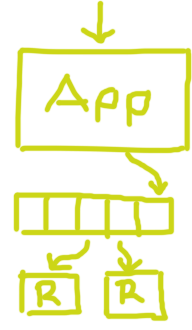

# Caldo de Kafka
## (para Node)

### Alberto Avila
### albertoavila@gmail.com
### @albertein
---

## Disclaimer

Not an actual javascript talk (sorry!)

---

## What is Kafka?

* Pub/Sub messaging rethought as a distributed commit log.

---

## The log[^1] :evergreen_tree:

[^1]: The Log: What every software engineer should know about real-time data's unifying abstraction http://bit.do/thelog

---

Append only ordered sequence of records

* Not unstructured error messages (i.e dmesg)
* Sequence of inputs (events) on a system
* Useful for distributed systems

---

### How to replicate my application state

1. On every request you write a log entry with the request itself and update your state
2. Replicas read from the log and applies the logged request to its current state 

--- 

### :fireworks: Hey, you just (re)invented DB replication! :fireworks:

---

### Let me sidetrack you for a moment

#### Real world problems

---

### Meet Wizeline

A user creates a Feature

* Now you need to send an email
* And a push notification
* And index it on Elasticsearch
* And also need to update the information on Jira
* And salesforce too!

Notice a trend?

---

### $$ n $$ systems $$ \rightarrow n^2 $$ connections

Yup, that was beyond my mouse-drawing skills.

---

### Decoupling services through a centralized log

Still, too hard to draw

---

## Sorry, back to kafka 

* Pub/Sub messaging rethought as a distributed commit log.
* Messages are divided on different partitioned feeds called _topics_
* Messages are __persistent__, they are not lost when consumed
* Having persistent messages provides a buffer between producers and consumers, if the consumer crashes the data will still be there when it comes back
* It also means you can rewind the log ;)

---

### Anatomy

---

---

### Consumers & Consumer groups

* Consumers keep track of their offset on the log
* Consumers commit the offset to a special kafka topic to recover in case of a crash 
* This gives "at least 1" delivery but you can get "exactly 1"
* Consumer groups automatically distribute partitions among themselves, free scaling (both up and down) up to the number of partitions on the topic

---

## # TODO: ADD DEMO

---

## Thank you ##

### albertoavila@gmail.com
### @albertein
